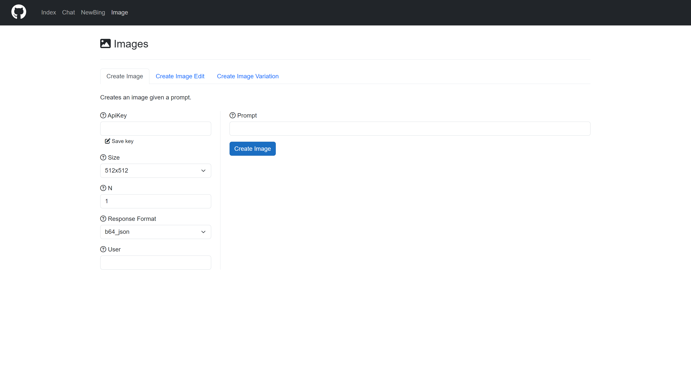

# AIStudio
## How to use

git clone Blazor App. Cd to appsetting.json and input your api key. Well you can input your apikey when you enter the website.

You can see update log in [Update Log](https://github.com/Hdurian-CH/AIStudio/tree/main/Update%20Log)

Login：

index:

Chat:

NewBing:

Image:

## Thanks

* [BingChat](https://github.com/bsdayo/BingChat)
* [Cledev.OpenAI.Studio](https://github.com/lucabriguglia/Cledev.OpenAI.Studio)

* [Microsoft Blazor](https://dotnet.microsoft.com/en-us/apps/aspnet/web-apps/blazor)