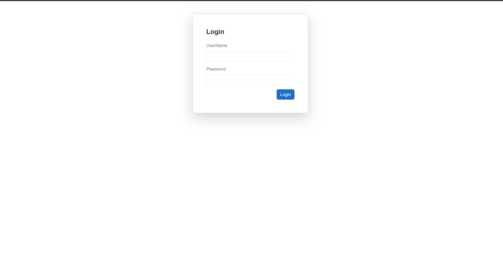
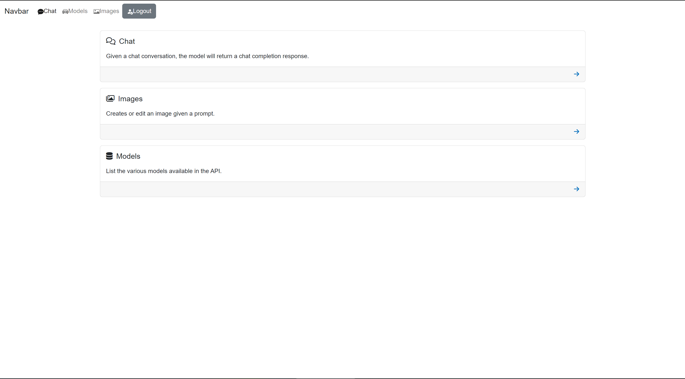
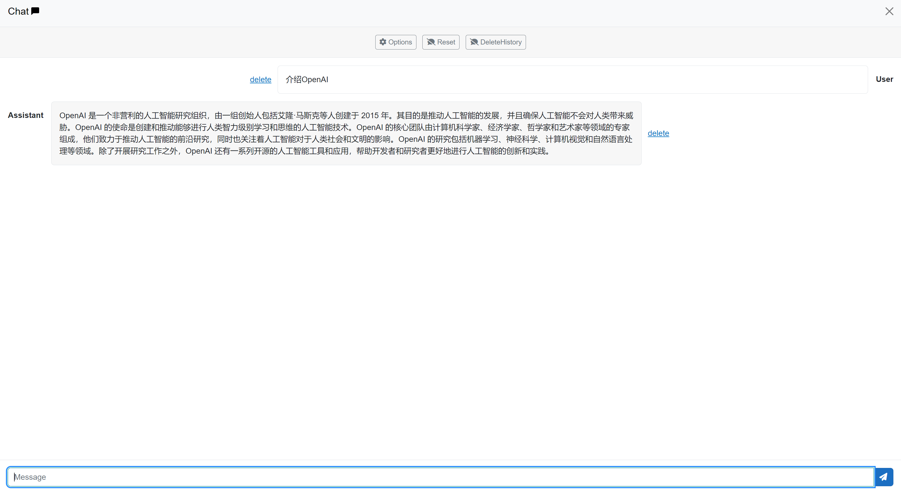
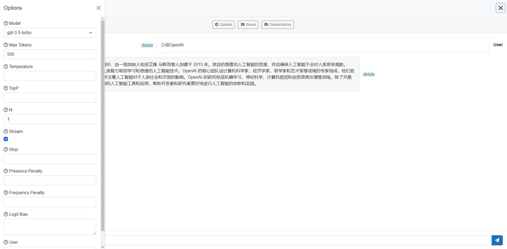
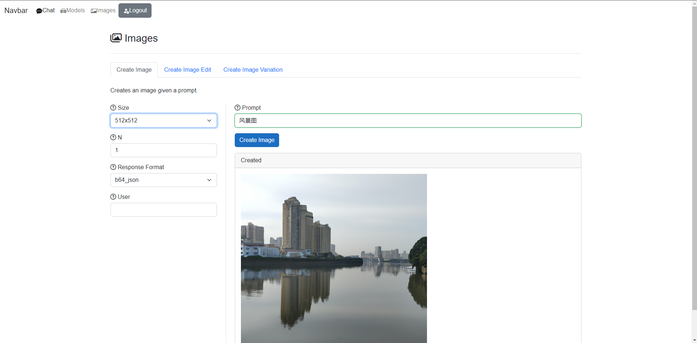

# AIStudio
## How to use

gitcline Blazor App. Cd to appsetting.json and input your api key and option_id.

## Update

* update Blazor LoacalStorage
* update gpt3.5-t-0613 and gpt3.5-t-16k-0613
* you can check your billing
* Authentication Provider

Login：

Index

index

Chat

Image
